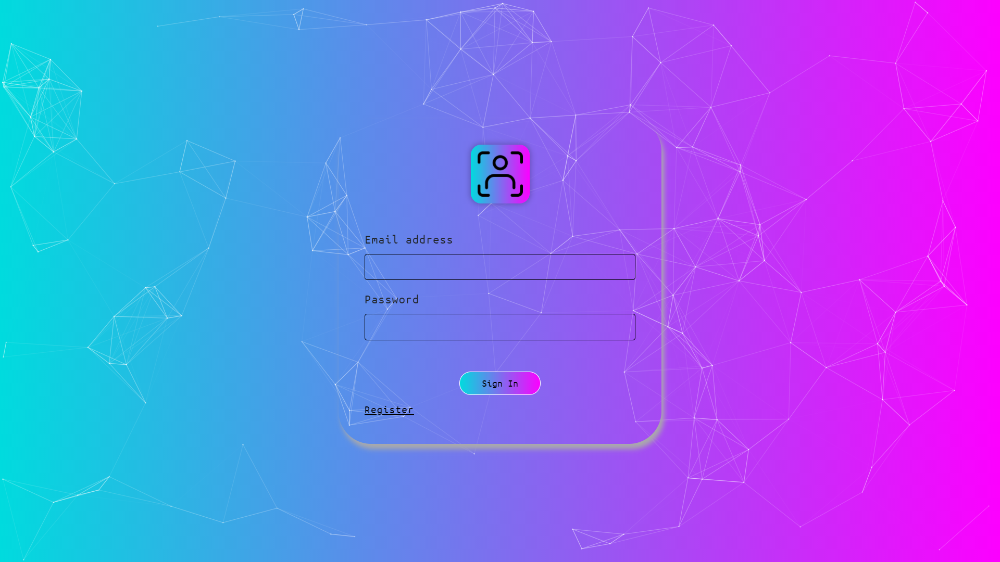
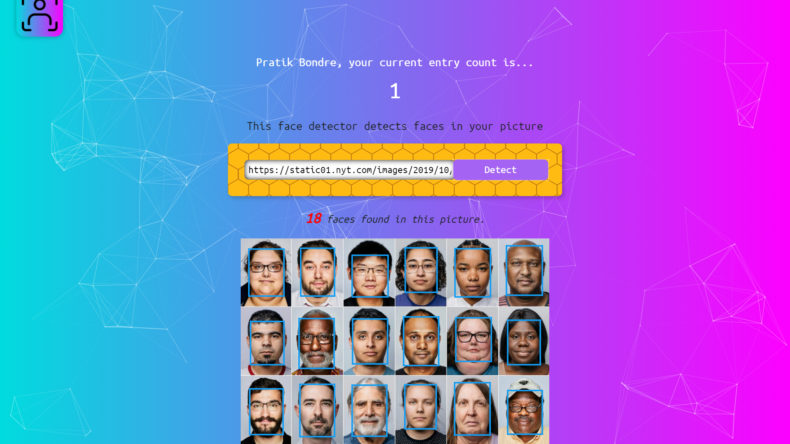
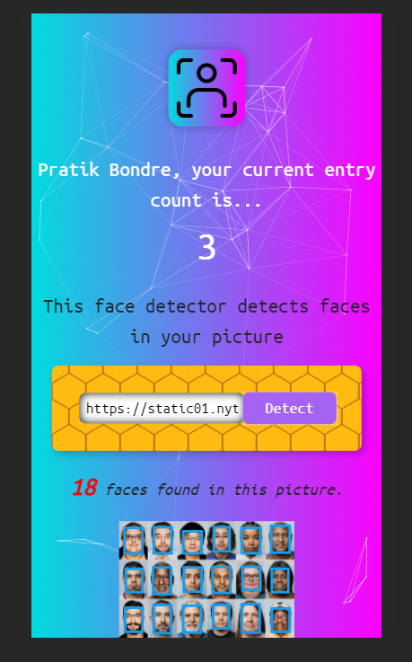

# **Face Detector App using PERN Stack**

- ### It detects the faces present in an image and creates a box around it and counts them.

---

- ### For the face detection I have used Clarifai API model, link is provided below
  - [Clarifai API](https://www.clarifai.com/models/ai-face-detection)

---

- ### In addition to this I have used user authentication for user registration and login so first user has to register on to the app before using it.

---

- ### I have used **PostgreSQL** database to store the user data, **NodeJS** & **ExpressJS** for the backend purpose and **React** for the frontend.

---

- ### React app is deployed on **GitHub Pages** and Node app is deployed on **Heroku** and database is created on the same.

  - [View React App](https://pratikbondre29.github.io/face-detector/)

---

## Screenshots

---

#### _Login page_

## 

#### _Home page_

## 

#### _Mobile view of app_

## Getting Started with Create React App

---

This project was bootstrapped with [Create React App](https://github.com/facebook/create-react-app).

In the project directory, you can run:

### `yarn start`

Runs the app in the development mode.\
Open [http://localhost:3000](http://localhost:3000) to view it in the browser.

The page will reload if you make edits.\
You will also see any lint errors in the console.

### `yarn test`

Launches the test runner in the interactive watch mode.\
See the section about [running tests](https://facebook.github.io/create-react-app/docs/running-tests) for more information.

### `yarn build`

Builds the app for production to the `build` folder.\
It correctly bundles React in production mode and optimizes the build for the best performance.

The build is minified and the filenames include the hashes.\
Your app is ready to be deployed!

See the section about [deployment](https://facebook.github.io/create-react-app/docs/deployment) for more information.
